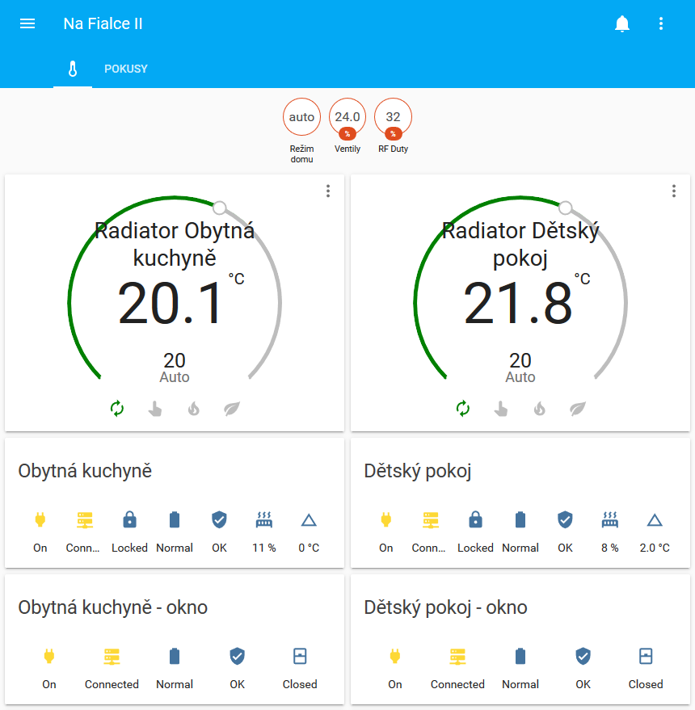

# hass_max_home_automation
Home Assistant support for MAX! Cube via MAX! Home Automation - HTTP API

## Preview


## Sample configuration
```yaml
# Example configuration.yaml entry
maxhomeautomation:
  gateways:
    host: localhost
    port: 8080
    scan_interval: 10
    cubes:
      - hex_address: 
        name: 
        radiator_thermostats:
          - hex_address:
            name: 
        wall_thermostats:
          - hex_address:
            name: 
        window_shutters:
          - hex_address:
            name: 
        eco_buttons:
          - hex_address:
            name:       
```
Notes: if you have no devices of some type, ie. wall_thermostat, leave the list empty. Omitting the list cause configuration error as described in [issue #3](https://github.com/koleo9am/hass_max_home_automation/issues/3).

## UI configuration example (one half of the screenshot)
```yaml
type: vertical-stack
  - entity: climate.obytna_kuchyne
    type: thermostat
  - columns: 7
    entities:
      - entity: binary_sensor.obytna_kuchyne_initialized
      - entity: binary_sensor.obytna_kuchyne_link
      - entity: binary_sensor.obytna_kuchyne_unlocked
      - entity: binary_sensor.obytna_kuchyne_low_battery
      - entity: binary_sensor.obytna_kuchyne_error
      - entity: sensor.obytna_kuchyne_valve
      - entity: sensor.obytna_kuchyne_offset
    show_name: false
    show_state: true
    title: Obytná kuchyně
    type: glance
  - columns: 5
    entities:
      - entity: binary_sensor.okenni_senzor_obytna_kuchyne_initialized
      - entity: binary_sensor.okenni_senzor_obytna_kuchyne_link
      - entity: binary_sensor.okenni_senzor_obytna_kuchyne_low_battery
      - entity: binary_sensor.okenni_senzor_obytna_kuchyne_error
      - entity: binary_sensor.okenni_senzor_obytna_kuchyne_open_window
    show_name: false
    show_state: true
    title: Obytná kuchyně - okno
    type: glance

```
Notes:
* Thermostat name is "Obytna kuchyne". 
* Window sensor name is "Okenni senzor obytna kuchyne".
* Use apropriate indent.

## Conditions
Feel free to use. Feel free to make Pull requests with enhanced features or correction of bugs.
Please note I have started with Home Assistant and MAX! Cube system on 02/15/2019. 
Hence this implementation is probably not following HA best practices.

As almost everyone I am developing this in my free time, so be kind in case I have delays in communication/enhancements.

## Deployment
I have Home Assistant and MAX! Home Automation installed on the same Raspberry PI Model 3B+.
MAX! Home Automation has enabled HTTP API only for localhost at 8080 port.

## Useful links
How to install MAX! Home Automation on Raspberry PI: https://sourceforge.net/p/max-home-automation/wiki/Raspberry%20installation/

## Feature list
* Climate Component (Eq-3 MAX!, Eq-3 MAX!+, Eq-3 Wall Thermostat)
  * Supported operational modes
    * Auto
    * Manual
    * Heat (via Eq-3 BOOST)
    * Eco (via Eq-3 VACATION)
  * Note: Eco operation mode via Eq-3 VACATION mode has fixed initial interval 365 days 
* Sensors
  * Current temperature (Eq-3 MAX!, Eq-3 MAX!+, Eq-3 Wall Thermostat)
  * Target temperature (Eq-3 MAX!, Eq-3 MAX!+, Eq-3 Wall Thermostat)
  * Valve (Eq-3 MAX!, Eq-3 MAX!+)
  * Offset (Eq-3 MAX!, Eq-3 MAX!+)
  * Mode (Eco button)
  * Cube RF duty cycle (MAX! Cube)
* Binary Sensors
  * Link error (Eq-3 MAX!, Eq-3 MAX!+, Eq-3 Wall Thermostat, Eco button, Window Sutter)
  * Error (Eq-3 MAX!, Eq-3 MAX!+, Eq-3 Wall Thermostat, Eco button, Window Sutter)
  * Low battery (Eq-3 MAX!, Eq-3 MAX!+, Eq-3 Wall Thermostat, Eco button, Window Sutter)
  * Panel unlocked (Eq-3 MAX!, Eq-3 MAX!+, Eq-3 Wall Thermostat, Eco button)
  * Initialized (Eq-3 MAX!, Eq-3 MAX!+, Eq-3 Wall Thermostat, Eco button, Window Sutter)
  * Open window (Window Sutter)
